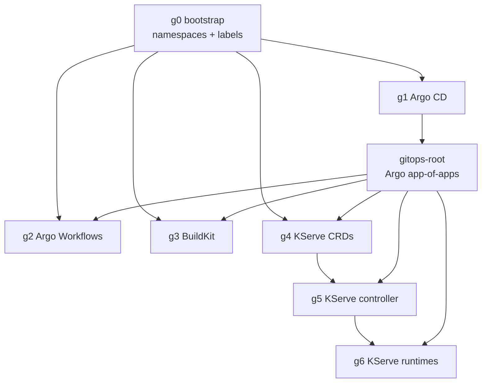

# Layer Architecture

```mermaid
flowchart TD
    G0["g0 bootstrap\nnamespaces + labels"] --> G1["g1 Argo CD"]
    G0 --> G2["g2 Argo Workflows"]
    G0 --> G3["g3 BuildKit"]
    G0 --> G4["g4 KServe CRDs"]
    G4 --> G5["g5 KServe controller"]
    G5 --> G6["g6 KServe runtimes"]
    G1 --> ROOT["gitops-root\nArgo app-of-apps"]
    ROOT --> G2
    ROOT --> G3
    ROOT --> G4
    ROOT --> G5
    ROOT --> G6
```

`g0`은 독립 배포 가능한 namespace baseline입니다. `g1` 이후부터는 직접 `kubectl`로 올릴 수도 있고, `clusters/dev/gitops-root` app-of-apps를 통해 Argo CD가 같은 레이어를 관리하게 할 수도 있습니다.
